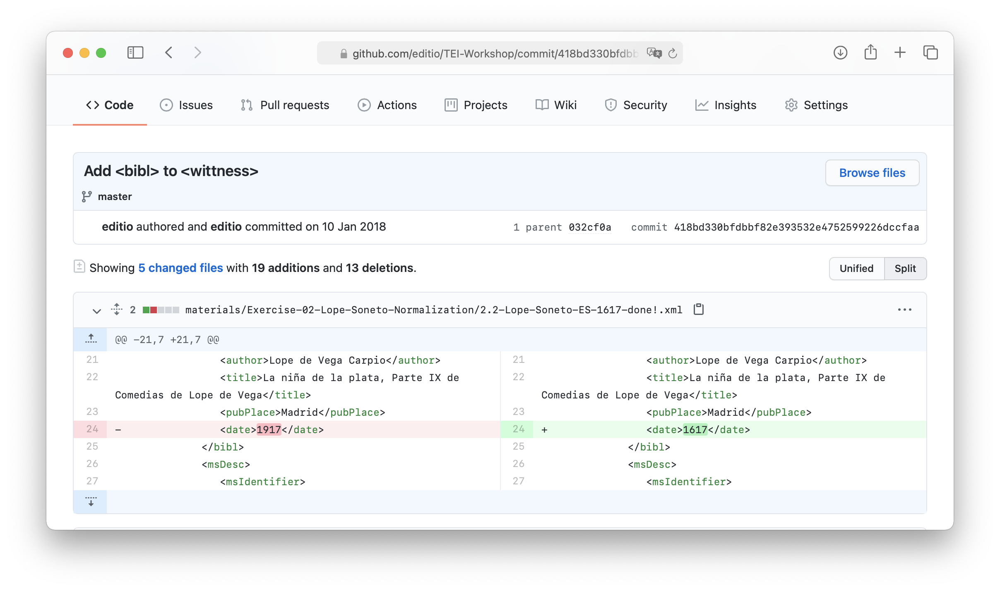
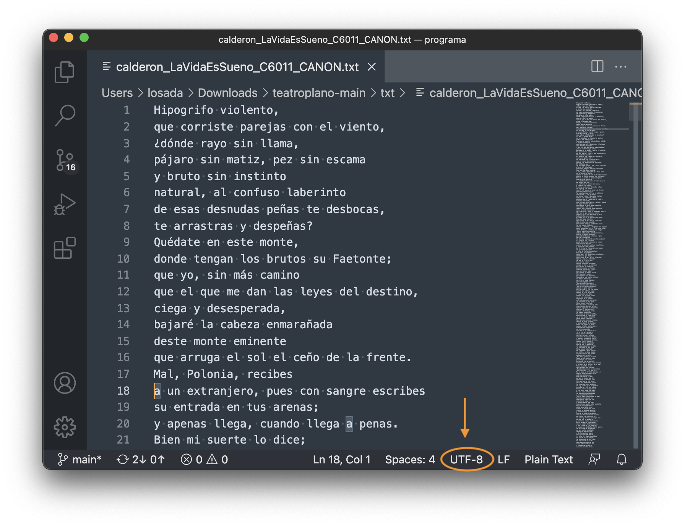
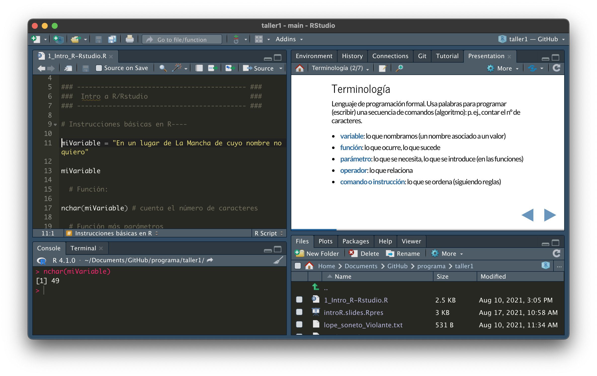
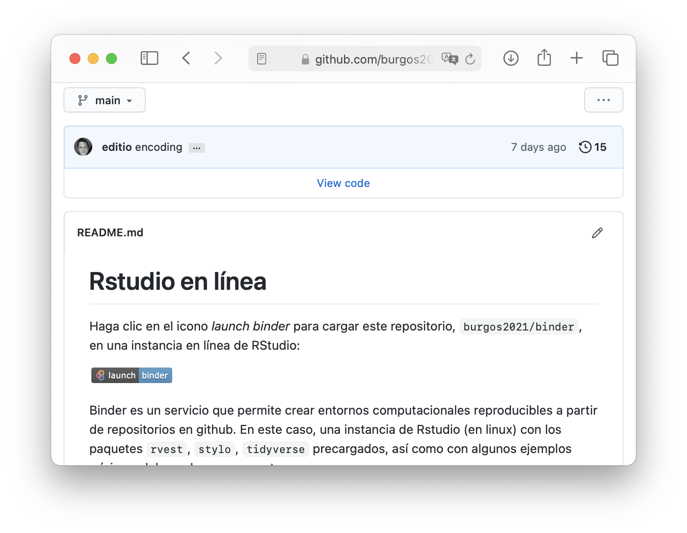
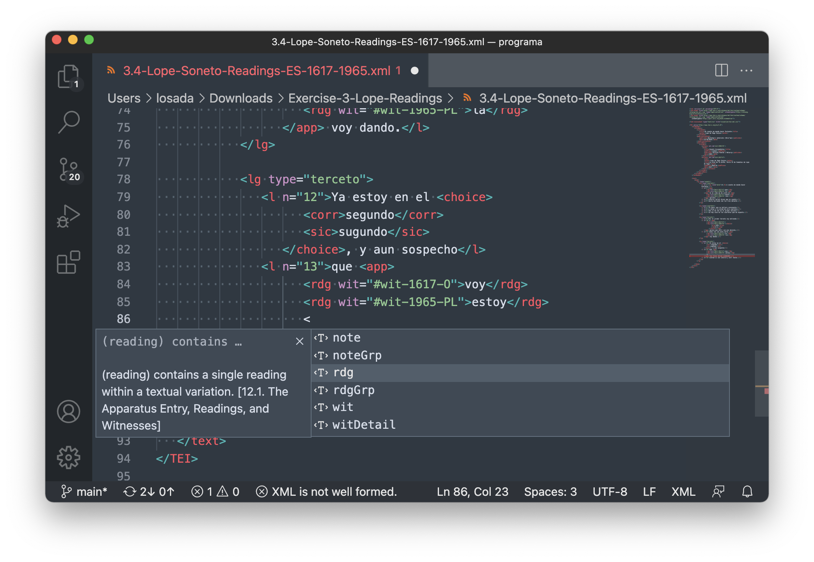
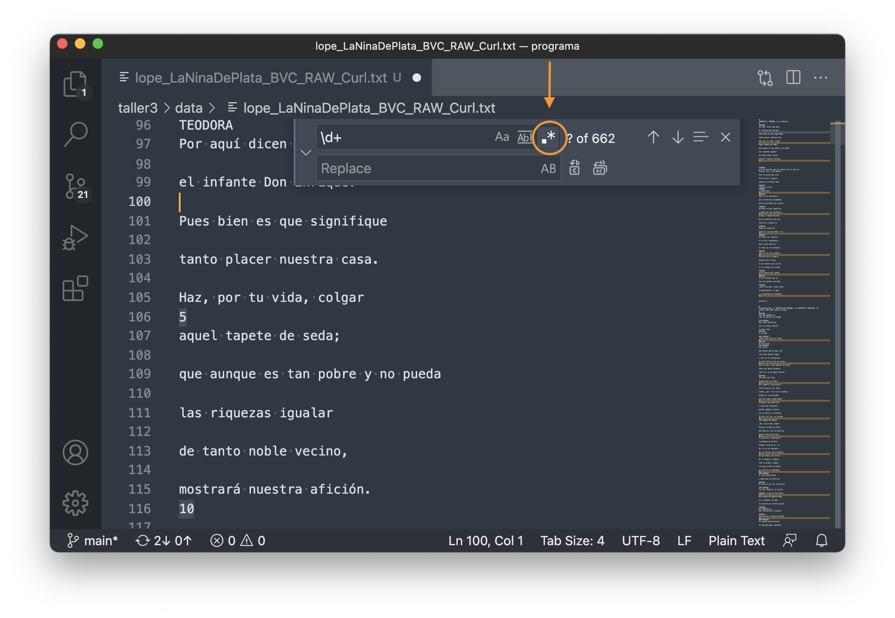

# **Taller 1 (previo). Conozca su ordenador**

<!-- SLIDES -->

## Contenidos 

1. Github (materiales del curso)
2. Rutas (_paths_), nombrar archivos y ver extensiones
3. Intro a R/Studio
4. Intro a Visual Studio Code
5. Intro a Línea de comandos

<!-- Presentación en línea: [Conozca su ordenador](http://editio.github.io/presentations/taller1_intro) LATER -->

## Materiales del curso en _Github_

Los materiales están alojados en acceso abierto en Github: <https://github.com/burgos2021/programa>; para acceder a ellos no es necesario tener una cuenta. 

Es posible descargarse todo el repositorio: 

<https://github.com/burgos2021/programa> > &#10515; `code` > `download zip`

### _github.com_

Página que aloja proyectos y archivos, en general para la creación de código. En este sentido es un repositorio de archivos, pero el núcleo es, en realidad, un sistema de control de versiones, llamado _Git_. 

Git es un software que se puede instalar en el ordenador para almacenar versiones de los archivos, de manera que en lugar de, por ejemplo, tener que realizar copias de archivos y carpetas manualmente (`trabajo_version1.txt`, `trabajo_version2_breve.txt`, `trabajo_version2_breve_definitiva.txt`, ...) Git registra y almacena instantáneas de ese archivo en sus distintos estadios. El control de versiones nos permite monitorizar nuestros trabajos, recuperando, por ejemplo, un párrafo que borramos o revirtiendo modificaciones.

> "Un control de versiones es un sistema que registra los cambios realizados en un archivo o conjunto de archivos a lo largo del tiempo, de modo que puedas recuperar versiones específicas más adelante. [...]  Dicho sistema te permite regresar a versiones anteriores de tus archivos, regresar a una versión anterior del proyecto completo, comparar cambios a lo largo del tiempo, ver quién modificó por última vez algo que pueda estar causando problemas, ver quién introdujo un problema y cuándo" (Chacon y Straub 2014)

Si usamos el programa _git_ en un servidor (github.com es la opción más conocida), podremos tener nuestros archivos en línea como una copia de respaldo (_backup_), compartir archivos entre distintos ordenadores o abrir a varias personas la colaboración en los documentos (código o ediciones, por ejemplo). En este último caso, git, nos ayuda a gestionar todos los cambios que provienen de distintas manos.

Existen varias maneras de trabajar con _git_: usando directamente la línea de comandos, a través de editores de texto avanzado, por medio del programa [Github desktop](https://desktop.github.com), directamente en la web de github (editor VScode _online_).

En nuestro caso, puede ser, por tanto, útil para mantener un corpus de trabajo junto con el código que usamos para su análisis, pero existen infinidad de ejemplos de uso de Github: código, corpus, cursos, proyectos, páginas personales, publicaciones, etc.

### Ejemplos de uso de github

**Código:**     

- Computational Stylistics Group: repositorio de desarrollo del paquete de stylo <https://github.com/computationalstylistics/stylo>; [página del grupo](https://computationalstylistics.github.io)

**Corpus:** 

- European Literary Text Collection (ELTeC): ejemplo del corpus de novelas en español <https://github.com/COST-ELTeC/ELTeC-spa>

- DraCor. Drama Corpora Project: repositorio en Github  <https://github.com/dracor-org>; [página del proyecto](https://dracor.org)

- Le théâtre de Molière en XML/TEI, édition LABEX OBVIL: repositorio en Github: <https://github.com/dramacode/moliere>; [edición de _Le Tartuffe, ou L’Imposteur_](https://obvil.sorbonne-universite.fr/corpus/moliere/moliere_tartuffe)
        
**Cursos:**

- The Programming Historian: repositorio en Github <https://github.com/orgs/programminghistorian/repositories>; [índice de lecciones](https://programminghistorian.org/es/lecciones/)
        
**Proyectos:**

- Digital mapping of literature: repositorio en Github <https://github.com/editio/mapping.literature>; [proyecto](https://editio.github.io/mapping.literature/)

**Publicaciones:**

- Hadley Wickham and Garrett Grolemund, _R for data science_: <https://github.com/hadley/r4ds>; [libro](https://r4ds.had.co.nz/)

Para saber más: ☞ Scott Chacon y Ben Straub (2014), Pro Git, 2.ª ed., Apress, <https://git-scm.com/book/es/v2>.

## Rutas (_paths_), nombrar archivos, extensiones

### Rutas en sistemas de archivos

Trabajamos con rutas constantemente cuando navegamos por nuestros archivos.

`/Users/losada/Documents/archivo.txt`

En un sistema de archivos, una ruta (_path_) es una lista de nombres de directorios separados por barras diagonales, lista que termina con el nombre de un directorio o el de un archivo. A los directorios también los podemos llamar carpetas (metáfora de directorio, pues usamos el icono de una carpeta en las interfaces gráficas); a las rutas las podemos llamar rutas de acceso (_pathname_) o simplemente ubicación, "indique la ubicación, ruta, ruta de acceso del archivo".

Windows utiliza una barra inclinada hacia atrás `\` (_forward slash_ o barra diagonal) como separador de rutas, mientras que los sistemas UNIX (Mac, Linux) utilizan una barra inclinada hacia delante  `/` (_backward slash_ o barra diagonal invertida)

**Linux, Mac:**

`/Users/losada/Documents` (ruta que termina en una carpeta)

`/Users/losada/Documents/archivo.txt` (ruta que termina en un archivo)

El primer `/` indica el directorio raíz _root_ en sistemas Mac y Linux. Users, losada, Documents son subdirectorios.

**Windows:**

`C:\Programa\datos`

`C:\Programa\datos\archivo.txt`

El directorio raíz en Windows se indica con `C:\`, una letra según la unidad de almacenamiento.

### Rutas absolutas y relativas

Una ruta de localización absoluta se evalúa desde el directorio raíz (_root_), mientras que una ruta de localización relativa se evalúa desde el directorio en su contexto (donde nos encontramos en un momento dado).

**ADD Ejemplo con dibujo con tu cuaderno**

Absoluta: `/Users/losada/programa/taller1/archivo.txt`

Relativa: `programa/taller1/archivo.txt` (desde `/Users/losada`)

    /📂 Users/
        └──📂 losada/
            ├──📂 programa/taller1/archivo.txt
            ├──📂 Documents
            ├──📂 Desktop
            └──📂 Downloads

### GUI frente a línea de comandos (terminal, powershell) o lenguajes de programación

Para controlar el ordenador nosotros usamos, sobre todo, interfaces gráficas de usuario (GUIs): accedemos a los archivos por las ventanas, en las carpetas, con el ratón, el trackpad o el teclado. Hay otras maneras de controlar el ordenador sin usar GUIs, tan solo con comandos que introducimos en un programa (línea de comandos) sirviéndonos solo del teclado y de palabras. En este caso, es importante saber cómo navegar las rutas donde se encuentran los documentos. Más adelante diremos dos palabras sobre la línea de comandos.

### Ejercicio mínimo: 

Localice la(s) barra(s) oblicua(s) en **su** teclado

### Ejercicio mínimo: 

Descargue los materiales en el ordenador y apunte la ruta donde se encuentran. Desacárguelos en un lugar fácilmente accesible.

https://github.com/burgos2021/programa > &#10515; `code` > `download zip`

☞ Consejo para la ruta en Mac: menú contextual (clic derecho) > copy + option "copy file as pathname".

### Nombrar archivos y ver extensiones

No todos los nombres de los archivos son procesados igualmente por todas las aplicaciones, por eso algunos caracteres pueden ser problemáticos si se usan para nombrar archivos. 

En otros contextos, la misma estructura del nombre del archivo puede ser útil para el procesamiento, como en los textos que usaremos con el programa `stylo` en R. El nombre del autor (o en su caso "desconocido", "anónimo") se separa del resto del nombre con un guión bajo `_`, de esta manera se puede, por ejemplo, clasificar automáticamente los textos por autor o asignarles colores distintos.

`calderon_LaVidaEsSueno_C6011_CANON.txt`

#### Algunas convenciones para nombrar archivos

Basado en: [collatex-tutorial](https://github.com/DiXiT-eu/collatex-tutorial/blob/master/unit1/Command_line.ipynb)

- Use solo letras, números, puntos `.`, guiones `-`, guiones bajos `_` . Importante: no utilice espacios ni signos de puntuación (excepto guiones, guiones bajos y puntos) ni caracteres con signos diacríticos: ñ, á, ö, ń, ê, ł, ... 

- Los nombres de archivo con varias palabras de contenido semántico pueden evitar los espacios usando guiones, guiones bajos o el llamado _CamelCase_: la combinación de mayúsculas y minúsculas juntas. Eliga uno de forma coherente en su sistema de archivos: `calderon_LaVidaEsSueno_C6011_CANON.txt`.

- Si mantiene varias versiones de un archivo en el mismo directorio es recomendable que le añada una fecha, con cuatro dígitos para el año y dos para el mes y el día: `2021-09-06_resultado-analisis.txt`. Puede pensar también en usar _Git_ si lo permite el tipo de archivo...

- Los nombres de los archivos deben llevar una extensión: .xml, .txt, .docx, .md, .csv

### Ejercicio mínimo: 

Localice el guión bajo en su teclado.

Active la visualización de las extensiones en su sistema operativo.

☞ [Show or hide filename extensions on Mac](https://support.apple.com/en-gb/guide/mac-help/mchlp2304/mac)

☞ [Show or hide filename extensions on Windows](https://support.microsoft.com/en-us/windows/common-file-name-extensions-in-windows-da4a4430-8e76-89c5-59f7-1cdbbc75cb01)

## Codificación de caracteres

Los ordenadores trabajan con bits y bytes, es decir, con números codificados en binario. Para almacenar, procesar o mostrar un texto, es necesario que exista una convención sobre cómo asignar a cada carácter (letra, dígito, carácter especial) un número. Esta correspondencia entre número y carácter se denomina codificación. Así, para un ordenador, un archivo de texto no es más que una fila de números que representa un texto en una codificación específica.

Al principio, solo existía una única asignación entre valores numéricos en el rango de 0 a 127, y letras (minúsculas y mayúsculas), dígitos y algunos caracteres especiales: la conocida codificación ASCII (años 60). El conjunto de los 128 caracteres ASCII representables no contenía caracteres europeos (se definió en EE.UU.) como el _Umlaut_, los acentos franceses o la eñe. Por lo tanto, fue necesario ampliar el estándar ASCII o sustituirlo por nuevas codificaciones para poder representar todos los caracteres importantes de alguna zona específica o incluso de todo el mundo. 

Por desgracia, existen muchas codificaciones diferentes incluso para representar el mismo conjunto de caracteres. Tienen nombres como ISO-8859-1, UTF-8 o Windows-1252. Al menos, la mayoría de las codificaciones utilizan la correspondencia ASCII para los 128 caracteres ASCII.

Cuando creamos los documentos, no todos los sistemas operativos guardan los archivos en la misma codificación. Depende no sólo del SO, también de la configuración de cada ordenador. En general, Mac y Linux guardan por defecto los archivos con la codificación UTF-8 (recomendable); Windows, en ISO-8859-1, para las configuraciones de alfabetos latinos.

En un archivo simple, aunque se sepa que representa un texto, no hay información sobre la codificación utilizada. Así que esto tiene que ser conocido de antemano o adivinado de alguna manera... En un archivo XML podemos indicarla al principio del archivo `<?xml version="1.0" encoding="UTF-8"?>`; igual en el HTML `<meta charset="utf-8">`; en un archivo TXT no es directamente visible, pero en todos los casos un editor de texto avanzado nos lo puede mostrar.

Fuentes: 

☞ ["Encodings or Why do I see strange characters?" (PDF, 11.08.2005)](https://www.ezv.admin.ch/dam/ezv/de/dokumente/archiv/a2/stammdaten_e-dec/encodings_or_whydoiseestrangecharacters.pdf.download.pdf)

☞ [Character encodings: Essential concepts](https://www.w3.org/International/articles/definitions-characters/index.en)

## Intro a R/Studio.

- Véase la presentación dentro de Rstudio: `introR.slides.Rpres > Preview`

### Instancia de Rstudio en línea

Hemos creado una instancia en línea de R/Rstudio en <https://github.com/burgos2021/binder> con algunos paquetes cargados por defecto y con unos ejemplos mínimos de uso. Puede trabajar y probar libremente sin aún no tiene instalado el programa en su ordenador o tiene algún problema de configuración. Es suficiente con hacer clic en _launch binder_ (sea paciente, puede tardar un poco).

☞ Véase la [bibliografía del curso](https://github.com/burgos2021/programa/tree/main/biblio#R-y-Rstudio) para R/Rstudio.

## Intro a Visual Studio Code

Visual Studio Code es un editor de texto avanzado similar a otros como Sublime, Notepad++, BBedit, etc., que facilitan la escritura de texto plano y código. Es gratuito, de código abierto y es multiplataforma (Mac, Windows y Linux). Puede ampliar mucho sus funcionalidades instalando paquetes. En este momento está en un momento álgido de desarrollo: Github permite, por ejemplo, editar los repositorios con VScode directamente en el navegador.

La comunidad de Humanidades digitales conoce [oXygen](https://www.oxygenxml.com) como el editor de XML-TEI por excelencia. Como un editor de texto avanzado es, en cualquier caso, fundamental para editar textos en un entorno de trabajo digital, vamos a aprovechar que VScode permite también, además de las funcionalidades comunes (Regex, por ejemplo), trabajar con documentos XML-TEI. Para facilitar el trabajo TEI es necesario instalar algunas extensiones ([Instrucciones de instalación](https://github.com/burgos2021/programa/tree/main/instrucciones#visual-studio-code))

Gracias a la extensión `Scholarly XML` una vez abierto un documento XML-TEI podremos usar las prestaciones que conocemos de oXygen: autocompletar, sugerencias de elementos, documentación TEI, validación (el XML necesita tener asociado un _schema_ RELAX NG). Es posible incluso usar hojas de transformación XSLT (más información sobre la configuración para documentos en TEI <http://phc.uni.wroc.pl/interreg/w/losada/VSCode.html>)

Usaremos VSCode también para trabajar con expresiones regulares. Se activan en el campo de búsqueda, pulsando sobre el icono `.*` a la derecha de la caja de búsqueda.

Menú: `Search > View` (búsqueda y sustitución en carpetas)

- `CMD+F` (Mac) `Ctrl+F` (Windows): búsqueda en el archivo abierto
- `Shift+CMD+F` (Mac) `Shift+CtrL+F` (Windows): búsqueda en carpetas
- `Shift+CMD+H` (Mac) `Shift+CtrL+H` (Windows): búsqueda y sustitución en carpetas
-  Desde el explorador: menú contextual (clic derecho) > búsqueda en una carpeta específica

☞ Sobre VScode y [_Find and Replace_](https://code.visualstudio.com/docs/editor/codebasics#_find-and-replace)

## Línea de comandos

Normalmente interactuamos con el ordenador de manera gráfica, con iconos, movimientos de ratón y clics, pero podemos hacerlo también de una mánera más directa, usando la línea de comandos, que interactúa con el ordenador usando solo texto. La línea de comandos se conoce también con otros nombres bash, shell, terminal, Command Prompt, PowerShell (que no son estrictamente sinónimos).

Es útil conocer su uso porque nos sirve para realizar operaciones de una manera más rápida, instalar y usar programas que no se sirven una interfaz gráfica de usuario o automatizar procesos. Para usar la analogía culinaria, usar la línea de comandos supone cocinar en lugar de ir a un restaurante (DHRI, 2021)

No todos los sistemas operativos tienen el mismo programa de línea de comandos. Las diferencias, como en otras ocasiones, se encuentran entre los sistemas UNIX (Mac y Linux) y Windows. En Mac el programa de línea de comandos se llama Terminal; en Windows, PowerShell. Se puede acceder a ellos como cualquier otro programa en nuestro ordenador, pues vienen instalados por defecto. Algunos programas, como Rstudio o Visual Studio Code, permiten acceder a la línea de comandos directamente desde sus entornos (sin necesidad de cargar Terminal o PowerShell).

Usando la línea de comandos podemos, por ejemplo, navegar por la estructura de un directorio con el comando `cd`, listar con `ls` qué archivos contiene, informar sobre en qué directorio estamos con `pwd`, descargar archivos de Internet con `curl` o saber qué versión de JAVA tenemos instalada `java -version`.

Estos son comandos que entiende el programa Terminal de Mac. Para entenderlos y ejecutarlos (`ls`, `mkdir`, `pwd`, etc.) este programa, Terminal, lleva un intérprete de lenguaje de comandos llamado _bash_. En Windows, su programa de línea de comandos, PowerShell, lleva otro intérprete, por lo que los comandos tienen distintos nombres o no son compatibles.

En este curso veremos el uso del comando, `curl` (descarga de archivos de Internet) solo con la intención de ejemplificar el uso de la obtención de datos con la línea de comandos, pero no instalaremos nada al respecto. Los usuarios de Windows podrán replicar en parte el uso de `curl` y la línea de comandos con _bash_ en la instancia en línea de Rstudio. 

Para más información sobre la línea de comandos, muy útiles son los siguientes tutoriales:

- Ian Milligan y James Baker, "Introducción a la línea de comandos en Bash", traducido por Víctor Gayol, The Programming Historian en español, 2021, <https://doi.org/10.46430/phes0013>

- Ted Dawson, "Introducción a la línea de comandos de Windows con PowerShell", traducido por Víctor Gayol, _The Programming Historian en español_, 2020, <https://doi.org/10.46430/phes0037>

- DHRI, "Introduction to the Command Line", Digital Humanities Research Institute, 2021 <https://curriculum.dhinstitutes.org/workshops/command-line/>

- Melanie Walsh, "The Command Line", en _Introduction to Cultural Analytics & Python_, Version 1 (2021), <https://melaniewalsh.github.io/Intro-Cultural-Analytics>