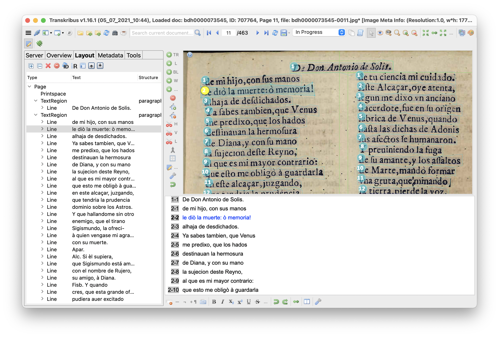

# **Taller 2. Datos**

<!-- PAGE -->

## Contenidos

1. Tipos de datos
2. Obtención de datos (`rvest` en R)
3. Tratamiento de datos (regex)
4. Reconocimiento automático (Transkribus)
5. Corpus disponibles en XML (Transformación XSLT)
6. Extra. Obtención de datos con el terminal (cURL)
7. Ejercicios

## Tipos de datos

Libros, cuadros, representaciones teatrales, novelas, poesías o películas son objeto de estudio de las humanidades. Aunque no solemos referirnos a ellos como datos, podríamos afirmar que el texto de un poema, los diálogos de una obra teatral o los elementos visuales de un cuadro de Picasso son en sí mismos datos. Este sentido se relaciona con una primera definición de dato, que remite a todo documento, información o testimonio que nos permite llegar al conocimiento de algo. Entendido de esta manera estamos hablando, sin embargo, de datos analógicos, datos que no son explícitamente contables como valores separados y distintos, es decir, no pueden ser analizados computacionalmente (Schöch 2013). Por este motivo, a esa primera definición de dato se le añade un segundo sentido como información dispuesta de manera adecuada para su tratamiento por una computadora.

A pesar del sentido etimológico de dato, que deriva del latín _datum_ (“lo que se da”) y del uso extendido de la expresión “datos en bruto” (_raw data_), no deberíamos pensar en los datos como un recurso natural disponible y listo para su uso, sino un recurso cultural que debe ser localizado, generado, sistematizado e interpretado para que tenga sentido (Gitelman/Jackson 2013: 2-3).

Los datos se localizan, se crean, se limpian, se simplifican, etc., antes poder generar información con ellos. Vamos a hacer un repaso a los tipos de datos y luego veremos algunas maneras de obtenerlos, manipularlos, limpiarlos y prepararlos para el análisis.

Necesitamos **datos de entrada** para el análisis estilométrico, en nuestro caso, en forma de textos (txt, xml), pero debemos tener en cuenta también cómo manipular los posibles **datos de salida**. El paquete de `stylo` acepta textos en formato txt y xml; podemos obtener datos de salida, por ejemplo, en csv para elaborar redes.

Podemos hablar de tres categorías de datos: estructurados (modelo explícito), semiestructurados (ciertas unidades marcadas) y no estructurados (sin unidades predefinidas). Suelen ser asociados con los tipos de archivo: CSV, XML, HTML, MD, TXT.

| Tipos | Definición | Formatos de archivos |
| --- | --- | --- | 
| Datos no estructurados | Sin una organización en unidades semánticas, separadas y distintas | Suelen almacenarse en formatos de archivo plano, por ejemplo, TXT. | 
| Datos semiestructurados | Con una estructura formal parcial (lenguaje de marcado)  que marca unidades  distintas  | Suele almacenarse en archivos XML o HTML. El vocabulario TEI es también XML.  | 
| Datos estructurados | Con un modelo concreto de datos que los define de forma explícita  | Archivos en formato de tabla como CSV, así como hojas de cálculo de los formatos de Excel o OpenOffice. | 

### Datos no estructurados

```
Hipogrifo violento,
que corriste parejas con el viento,
¿dónde rayo sin llama,
pájaro sin matiz, pez sin escama
y bruto sin instinto
natural, al confuso laberinto
...
```

- Archivos en formato plano (_plaintext_).
- Archivos con extensión .TXT

### Datos estructurados

|id    |título            |año |etiqueta|disponible|
|------|------------------|----|--------|----------|
|1     |Polifemo          |1612|poesía  |TRUE      |
|2     |Quijote           |1605|novela  |TRUE      |
|3     |Príncipe constante|1647|teatro  |TRUE      |
|4     |Persiles          |1617|novela  |FALSE     |

- Archivos en formato plano (_plaintext_)
- Archivos con extensión .CSV
- Compuestos de variables y observaciones

| Variable | Variable | Variable | <i style="color: grey">etiqueta</i> | <i style="color: grey">disponible</i> |
| --- | --- | --- | --- | --- |
| observación | observación  | observación | <i style="color: grey">poesía</i> | <i style="color: grey">TRUE</i> |
| observación | observación  | observación | <i style="color: grey">novela</i> | <i style="color: grey">TRUE</i> |
| observación | observación  | observación | <i style="color: grey">teatro</i> | <i style="color: grey">TRUE</i> |
| observación | observación  | observación | <i style="color: grey">novela</i> | <i style="color: grey">FALSE</i> |

El formato de archivo con la extensión `.CSV` se usa para estructurar datos en forma de tabla divididos en columnas y filas. En el fondo, el texto contenido está también en formato plano (_plain text_), solo que técnicamente usa ciertas convenciones (comas, comillas, saltos de línea) para estructurar los datos que contiene: la coma separa celdas; los saltos de línea separan filas; las comillas, rodean valores que tienen comas o saltos de línea; la primera fila (opcional) designa los nombres de las variables (columnas):

```
id,título,año,etiqueta,disponible
1,Polifemo,1612,poesía,TRUE
2,Quijote,1605,novela,TRUE
3,Príncipe constante,1647,teatro,TRUE
4,Persiles,1617,novela,FALSE
```

Otras convenciones en archivos de texto plano, por ejemplo, ficheros .bibtex. La bibliografía del curso está disponible en formato .bibtex en el [repositorio](https://github.com/burgos2021/programa/blob/main/biblio/biblio_burgos2021.bib)

```
@article{eder2016a,
  author = {Eder, M.},
  date = {2016},
  title = {Rolling stylometry},
  volume = {31},
  pages = {457–469},
  url = {https://doi.org/10.1093/llc/fqv010},
  doi = {10.1093/llc/fqv010},
  language = {en},
  journal = {Digital Scholarship in the Humanities},
  number = {3}
}
```

### Datos semiestructurados

**XML**

Al texto no estructurado se le añade información semántica anotando algunas palabras con etiquetas dobles que rodean los elementos que nos interesan. El nombre propio se rodea con una etiqueta de apertura `<persName>` y otra de cierre `</persName>`. 

```<persName>Miguel de Cervantes</persName> publicó la primera parte del <title>Quijote</title> en <date>1605</date>```
 
- Expresados con lenguajes de marcado que anotan de forma separada y distinta los elementos dentro de datos.
- Marcado descriptivo. Información semántica.
- Archivos con extensión .XML (_eXtensible Markup Language_).
- Vocabulario: TEI (Text Encoding Iniciative).

**HTML**

```Miguel de Cervantes publicó la primera parte del <i>Quijote</i> en 1605```

- Archivos con la extensión .html (_Hypertext Markup Language_)
- Marcado procedural: basado en la representación

**Markdown**

- Archivos con la extension .MD (_Markdown_)
- Marcado procedural simplificado: basado en la representación

```Miguel de Cervantes publicó la primera parte del _Quijote_ en 1605```

## Obtención de datos

### Textos de Internet en formato html. **Rvest en R**

Internet es sin duda un amplio recurso de datos y textos. Estos están disponibles en varias formatos, pero una buena parte los encontramos todavía en html. Veremos una manera de automatizar la recolección de textos en formato html de Internet y transformarlos a texto plano, que nos interesa para el análisis.

Vamos a usar un paquete en R, `Rvest`, pero coexisten varias maneras de descargar datos de la red, por ejemplo, usando la línea de comandos.

- Véase la presentación dentro de Rstudio: `text_with_Rvest.Rpres > Preview`

## Tratamiento de datos

Los textos cosechados de Internet casi nunca terminan listos acorde a nuestras necesidades. Ya sean textos extraídos de un html, obtenidos de un proceso de OCR o de HCR e incluso disponibles en una codificación XML, necesitarán alguna modificación que los ajustem a nuestras necesidades. Los metadatos, los encabezados, los errores, los nombres de los personajes de una obra teatral suelen ser eliminados para, por ejemplo, el análisis estilométrico. Para automatizar muchos de esos procesos de limpieza nos ayudan las expresiones regulares.

Las expresiones regulares, Regex (_Regular expressions_), son una manera de buscar no tanto una palabra o secuencia de palabras, sino un patrón. Buscando y sustituyendo patrones, nos permiten de una manera rápida (pero compleja), rehacer, extraer, limpiar un texto. Una expresión regular es una secuencia de caracteres que funciona como patrón, es decir, de de muestra para obtener su correspondiente: `\d` es un patrón para encontrar dígitos (del 0 a 9).

Las regex son una parte esencial de los lenguajes de programación, podemos trabajar directamente con ellas en R, pero también podemos usarlas directamente en un procesador de textos avanzado, como VScode, sublime, oXygen, etc.

Textos teatrales con información que no nos interesa: números, mayúsculas, espacios.

## Reconomiento automático

- Tesseract
- Transkribus 
    
    - Versiones semi diplomáticas frente a normalizadas. Modelos en Transkribus
    - Tratamiento del _output_ en XML



## Corpus disponibles en XML

- Tratamiento de datos: del xml al txt. Transformacion (XSLT)
- Fuentes

## Extra. Obtención de datos con el terminal (cURL)
## Ejercicios
