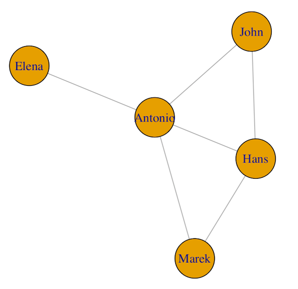
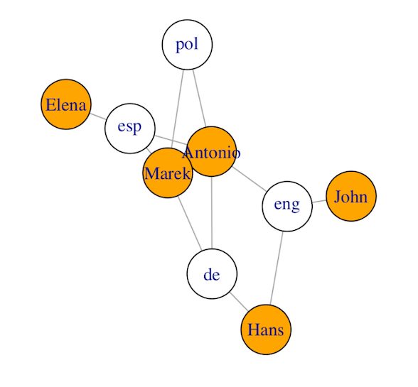
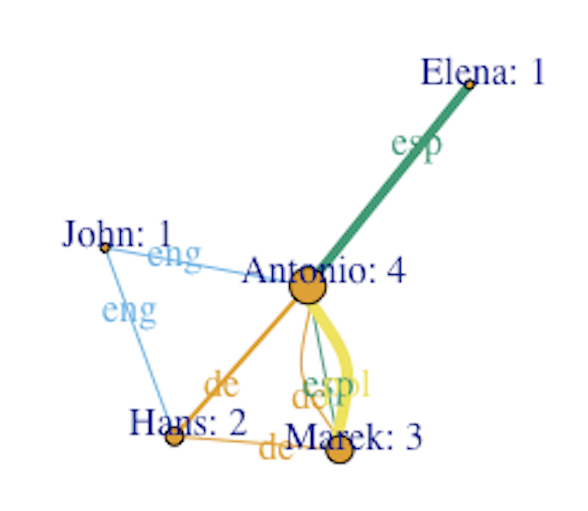
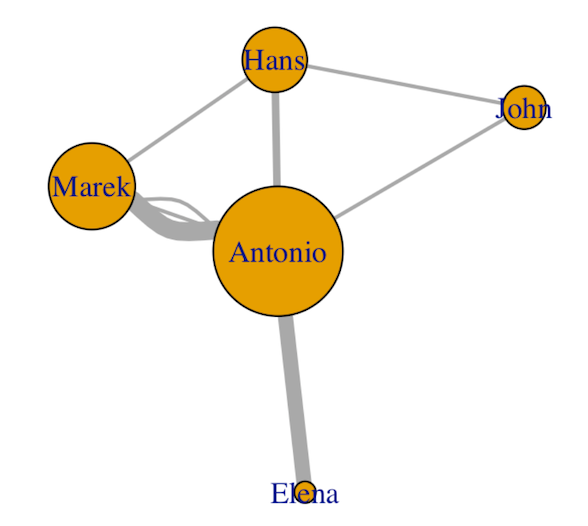
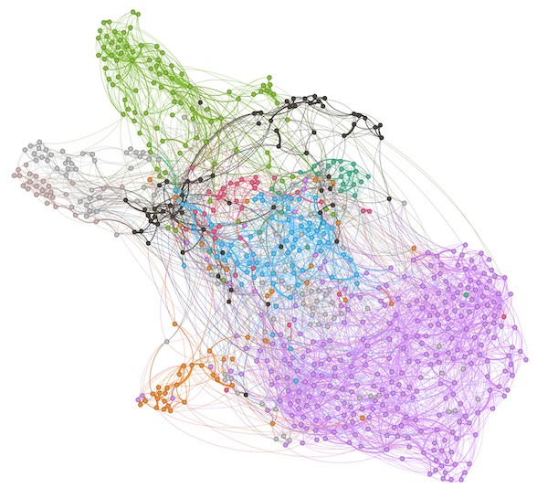

Redes. Conceptos básicos
========================================================
title: R/Rstudio
author: José Luis Losada Palenzuela
date: 25/08/2021
autosize: TRUE

Redes
========================================================

- Método de representación de patrones de conexión o interacción entre partes de sistema. 

- El concepto de red supone una estructura relacional que puede ser estudiada (1) de forma lógica y matemática: Teoría de grafos (disciplina). 
- (2) Exploración por medio de la visualización.

Redes. Conceptos básicos
========================================================

- Red: puntos unidos por líneas.
- Puntos: **nodos** o vértices ( _nodes_ o _vertices_ ).
- Líneas: **aristas** o enlaces ( _edges_ o _links_ ).
- Tipos de redes: simples, bipartitas, múltiples, no dirigidas...

========================================================

- red simple
 
========================================================

 
- red bipartita 

========================================================
 
 
  
- red múltiple
 
Redes. Formalización de datos  
========================================================

- Lista de aristas, lista de adyacencia, matrices, ...

**Lista de aristas (_edgelist_)**: es conjunto de datos estructurados (tabla) que contiene como mínimo dos columnas: una columna de nodos que son el origen de una conexión (_source_) y otra columna de nodos que son el destino de la conexión (_target_). 

|source |target|weight|lang|type|
|-------|------|----|-----|----|
|Antonio|Elena |4 |esp     |undirected|
|Antonio|Hans  |12  |de     |undirected|
|Antonio|John  |1 |eng     |undirected|
|Antonio|Marek |1  |de     |undirected|
|...|... |... |...|...|

Redes. Métricas
========================================================

- Medidas de centralidad (_degree_, _eigenvector_,etc.), modularidad...

 

Redes. Visualización
========================================================

- Algoritmos para dibujar el grafo. 
- _Force Atlas_, _Fruchterman Reingold_,...

Redes. stylo()
========================================================

- Redes simples, no dirigidas, peso ponderado
- Bootstrap Consensus Tree

|Source|Target|Weight|Type|
|------|------|-----|----|
|calderon_ElPrincipeConstante|calderon_LaHijaDelAireParteI|43 |undirected|
|calderon_ElPrincipeConstante|calderon_LaVidaEsSueno       |59   |undirected|
|calderon_ElPrincipeConstante|lope_Fuenteovejuna           |30   |undirected|
|calderon_LaHijaDelAireParteI|calderon_ElPrincipeConstante |43   |undirected|
|calderon_LaHijaDelAireParteI|calderon_LaVidaEsSueno       |47   |undirected|
|calderon_LaHijaDelAireParteI|lope_ElPerroDelHortelano     |24   |undirected|
|calderon_LaHijaDelAireParteI|lope_LaDamaBoba              |13   |undirected|
|calderon_LaHijaDelAireParteI|moreto_ElDesdenConElDesden |5  |undirected|
|calderon_LaHijaDelAireParteI|moreto_ElLindoDonDiego       |7  |undirected|
|...|... |.. |...|

Redes. stylo()
========================================================

Redes. Tutoriales y manuales
========================================================

- Katherine Ognyanova, [Static and dynamic network visualization with R](https://kateto.net/network-visualization), 2021

- Albert-László Barabási, [Network Science](http://networksciencebook.com), 2016
- Katharina A. Zweig, _Network Analysis Literacy: A Practical Approach to the Analysis of Networks_, Springer, 2016.

- Mark Newman, _Networks: An Introduction_, Oxford University Press, 2010

Redes. Visualización
========================================================

- Algoritmos para dibujar grafos de forma visual. 
- El algoritmo _Force Atlas_  tiene en cuenta el peso de las aristas.
